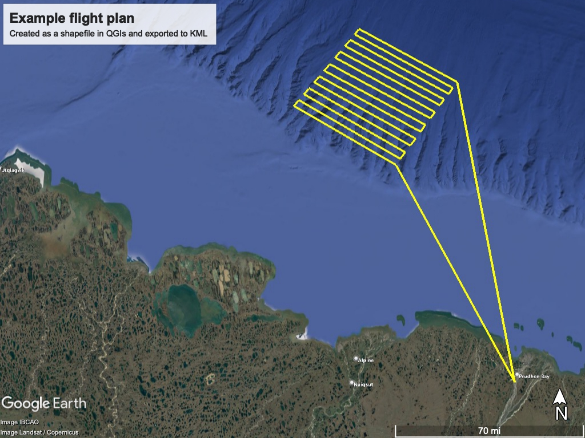
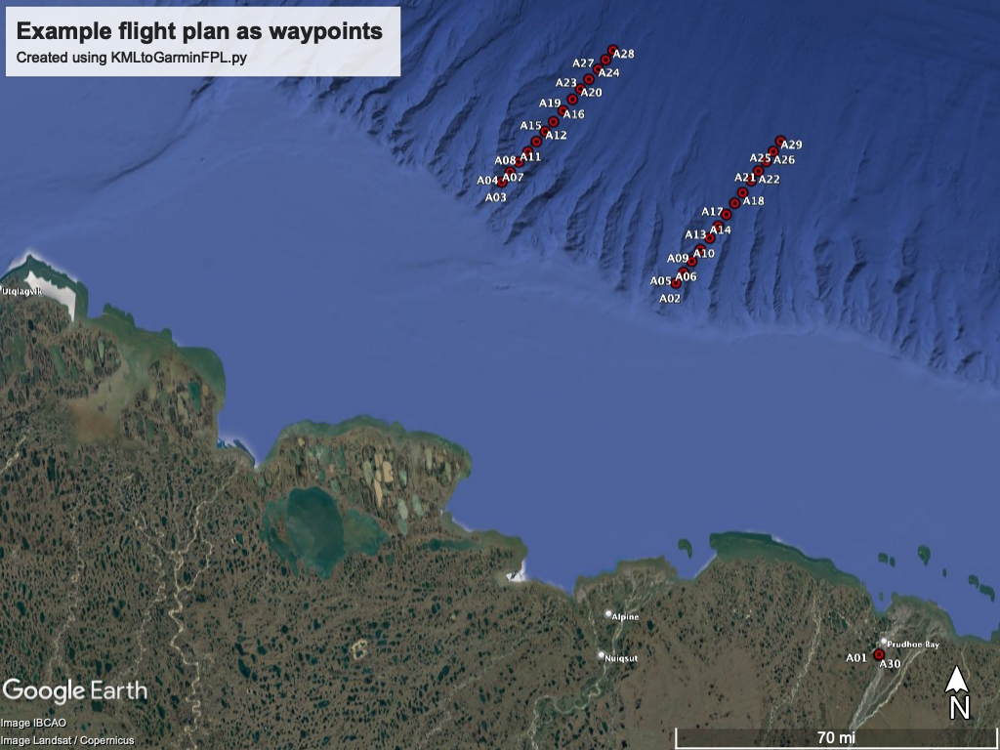
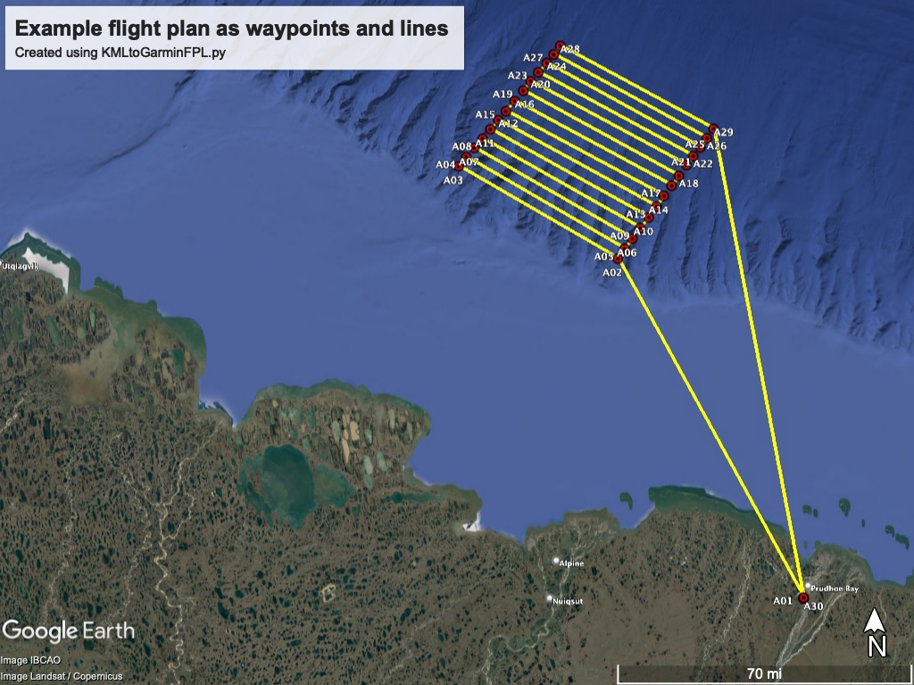

# KMLtoGarminFPL

This repository contains a Python program to convert a flight plan defined as a KML file to the Garmin FPL flight plan (FPL) format. The Garmin FPL flight plan format is used in Garmin GNS 400w/500w model series used in some aircraft.

Authors: Severine Fournier (NASA/JPL), Tom Hutchinson (Kenn Borek Air), Ian Fenty (NASA/JPL)
Date: 2022-09-24

## Software Required ##
1. Python 3
2. Garmin FlightPlan Migrator with USB Drivers software version 3.10: https://www8.garmin.com/support/download_details.jsp?id=4471

## Hardware Required ##
1. Computer with a windows operating system 
2. Garmin FlightPlan Migrator Kit: https://www.garmin.com/en-US/p/35228/pn/010-11308-20

### A note about the Garmin FlightPlan Migrator Hardware and Software ###

To transfer FPL files to a Garmin GNS unit via card, you need the special Garmin card reader/writer and the FlightPlan Migrator software. The card and reader seem to be proprietory. Even after installing the drivers, the card reader with the card inserted do not appear as external drives from Windows (unlike a typical USB drive, for example). The Garmin FlightPlan Migrator software lets you load FPL files on the card into one of 19 spaces.

Garmin card reader/writers are available from Amazon for about $70 (as of September 2022). https://www.amazon.com/dp/B01JTFZPFG?psc=1&ref=ppx_yo2ov_dt_b_product_details

I don't know if the cards can be purchased separately. Perhaps they are only sold in the Garmin FlightPlan Migrator Kit.


## Instructions ##

1. Create a new flight plan and save it as a KML file. For example, 'new_flight_plan.kml'
2. Decide on a prefix to name the waypoints of the new flight plan. For example, if you choose the prefix "A", the waypoints will be named: A01, A02, ..., A99.
3. Use python to run the KMLtoGarminFPL.py program like this:  "python ./KMLtoGarminFPL.py -i new_flight_plan.kml -n A"
4. The program will generate two files: "new_flight_plan_as_waypoints_A.kml" and "new_flight_plan_as_waypoints_A.fpl". The "new_flight_plan_as_waypoints_A.kml" file contains the new flight plan waypoints in a KML file. The "new_flight_plan_as_waypoints_A.fpl" file contains the new flight plan waypoints and the flight route in the Garmin FPL format.
5. Load the "new_flight_plan_as_waypoints_A.fpl" file onto a Garmin card using the Garmin FlightPlan Migrator software and the Garmin FlightPlan Migrator Kit's special card reader.
6. From the cockpit, remove the original card from the slot on the right side of the Garmin GNS unit.
7. Insert the card with the new FPL file into the slot on the right side of the Garmin GNS unit.
8. Power on the Garmin GNS unit.
8. Using the Garmin menu system, load the waypoints and flight plan. 
9. << IMPORTANT >> Turn off the Garmin GNS unit, remove the card with the FPL file, replace it with the original card, and then turn the Garmin GNS unit on
10. Confirm that the new waypoints and flight plan are loaded.


## Flight Plan KML files ##

During our project we defined flight plans as multi-part line shapefiles in QGIS and exported them as KML files. The resulting KML files defined the flight plan by a set of "longitude, latitude" locations, each defining the start/end point of each line segment. Specifically, the KML files have blocks like this:

```
<MultiGeometry><LineString><coordinates>-148.409488684457,70.1879369846318 -150.185878001433,71.3641064917923 -151.868207666983,71.6826939896295 -151.786142805248,71.7138328639197 -150.110904212891,71.395591937114 -150.025993171817,71.4296743112763 -151.700658574275,71.7449206097164 -151.610999271859,71.7760539944028 -149.93793727737,71.4646961861542 -149.843591676177,71.4996543291621 -151.526088230785,71.8074996278754 -151.438032336339,71.8388928343137 -149.75553578173,71.535544895473 -149.67376959403,71.5713682569899 -151.356266148638,71.869255081541 -151.258775694072,71.9034760808731 -149.585713699583,71.6051398244629 -149.503947511882,71.6368702451494 -151.164430092879,71.9376346478209 -151.082663905178,71.9697842051396 -149.415891617436,71.6725038002111 -149.340415136481,71.7021474148267 -150.997752864105,71.9999349054457 -150.903407262912,72.0310070735427 -149.258648948781,71.730758889851 -149.183172467826,71.7612957842083 -150.824785928584,72.0600901208561 -150.752454301003,72.0891276428685 -149.104551133499,71.7917833693959 -148.409538538044,70.1842836276263</coordinates></LineString></MultiGeometry>
```

Note that each  "longitude, latitude" pair is separated by a space and that the entire flight plan is defined in a single <coordinates></coordinates> block. The KMLtoGarminFPL.py Python code parses these coordinate pairs and simply rewrites them into a format that the the Garmin FlightPlan Migrator can understand.

Note: your input KML file has to have the same general format as the example code block above for the Python program to work. If your input KML file looks different, modify the Python code so that it parses your KML or reformat your KML. 

## Example ##

We include two example INPUT kml files and their corresponding OUTPUT fpl files. Input files:
1. Example_flight_plan_lines_Day_01.kml
2. Example_flight_plan_lines_Day_02.kml

### Day 01 Example ###

The Day 01 Example input KML file is located in 
```./examples/Example_flight_plan_lines_Day_01.kml```

If you load this KML file into Google Earth or another software then you'll see the flight plan is a set of connected lines, starting and ending from Deadhorse Airport (PASC) in Prudhoe Bay, Alaska.



Now run the program, point to the Day 01 example flight plan KML file, and choose "A" as our waypoint prefix:

```
python ./KMLtoGarminFPL.py -i ./examples/Example_flight_plan_lines_Day_01.kml -n A
```

The output is as follows:

```
==============================================

Welcome to the KML to Garmin FPL tool

  -----------------------------------
  |   Severine Fournier (NASA/JPL)  |
  | Tom Hutchinson (Kenn Borek Air) |
  |       Ian Fenty (NASA/JPL)      |
  -----------------------------------

Input KML filename is  ./examples/Example_flight_plan_lines_Day_01.kml
Waypoint prefix is  A

Output files will be 
   kml waypoints: ./examples/Example_flight_plan_lines_Day_01_as_waypoints_A.kml
   fpl waypoints and route: ./examples/Example_flight_plan_lines_Day_01_as_waypoints_and_route_A.fpl

opening  ./examples/Example_flight_plan_lines_Day_01.kml

Coordinates read from the input kml file
 #     lon      lat
---------------------
  1  -148.409  70.188
  2  -150.186  71.364
  3  -151.868  71.683
  4  -151.786  71.714
  5  -150.111  71.396
  6  -150.026  71.430
  7  -151.701  71.745
  8  -151.611  71.776
  9  -149.938  71.465
 10  -149.844  71.500
 11  -151.526  71.808
 12  -151.438  71.839
 13  -149.756  71.536
 14  -149.674  71.571
 15  -151.356  71.869
 16  -151.259  71.903
 17  -149.586  71.605
 18  -149.504  71.637
 19  -151.164  71.938
 20  -151.083  71.970
 21  -149.416  71.673
 22  -149.340  71.702
 23  -150.998  72.000
 24  -150.903  72.031
 25  -149.259  71.731
 26  -149.183  71.761
 27  -150.825  72.060
 28  -150.752  72.089
 29  -149.105  71.792
 30  -148.410  70.184

Write KML file: ./examples/Example_flight_plan_lines_Day_01_as_waypoints_A.kml

Write FPL file: ./examples/Example_flight_plan_lines_Day_01_as_waypoints_and_route_A.fpl

              GOOD LUCK! 
==============================================
```

You should be able to load the new FPL file in ```./examples/Example_flight_plan_lines_Day_01_as_waypoints_and_route_A.fpl``` into the Garmin FlightMigrator program and save it on the Garmin card.

The new KML file ``` ./examples/Example_flight_plan_lines_Day_01_as_waypoints_A.kml``` only includes the waypoints of the flight plan, with each waypoint named A01, A02, ... A99.



If you load the original KML flight LINES and the new KML flight WAYPOINTS you'll see the following:




### Day 02 Example ###

We include a second example day (input flight line KML and output waypoint KML and output FPL file) for your reference.  The code to run it is:

```python ./KMLtoGarminFPL.py -i ./examples/Example_flight_plan_lines_Day_02.kml -n B```

The output is:

```
KMLtoGarminFPL.py -i <input_kml_file> -o <output_file_noformat> -n <waypoint_prefix>

==============================================

Welcome to the KML to Garmin FPL tool

  -----------------------------------
  |   Severine Fournier (NASA/JPL)  |
  | Tom Hutchinson (Kenn Borek Air) |
  |       Ian Fenty (NASA/JPL)      |
  -----------------------------------

Input KML filename is  ./examples/Example_flight_plan_lines_Day_02.kml
Waypoint prefix is  B

Output files will be 
   kml waypoints: ./examples/Example_flight_plan_lines_Day_02_as_waypoints_B.kml
   fpl waypoints and route: ./examples/Example_flight_plan_lines_Day_02_as_waypoints_and_route_B.fpl

opening  ./examples/Example_flight_plan_lines_Day_02.kml

Coordinates read from the input kml file
 #     lon      lat
---------------------
  1  -148.405  70.190
  2  -149.963  71.322
  3  -149.969  72.999
  4  -150.476  72.997
  5  -150.455  71.317
  6  -150.959  71.325
  7  -150.975  73.007
  8  -151.484  72.997
  9  -151.483  71.317
 10  -152.004  71.318
 11  -151.984  73.005
 12  -152.488  73.002
 13  -152.462  71.312
 14  -152.978  71.283
 15  -152.976  72.998
 16  -153.463  72.992
 17  -153.490  71.200
 18  -154.175  71.190
 19  -154.163  73.000
 20  -154.966  72.998
 21  -154.971  71.205
 22  -153.994  70.598
 23  -153.939  70.598
 24  -153.888  70.597
 25  -153.394  70.591
 26  -152.911  70.584
 27  -152.852  70.583
 28  -152.805  70.582
 29  -148.405  70.190

Write KML file: ./examples/Example_flight_plan_lines_Day_02_as_waypoints_B.kml

Write FPL file: ./examples/Example_flight_plan_lines_Day_02_as_waypoints_and_route_B.fpl

```

**Good luck out there!!**

